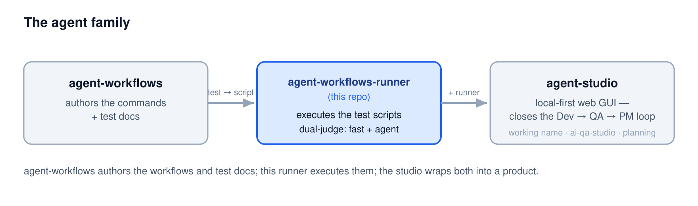
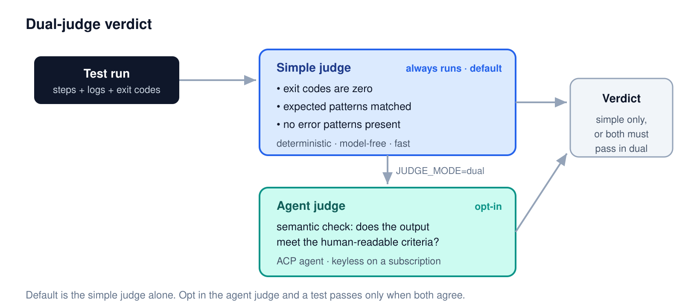
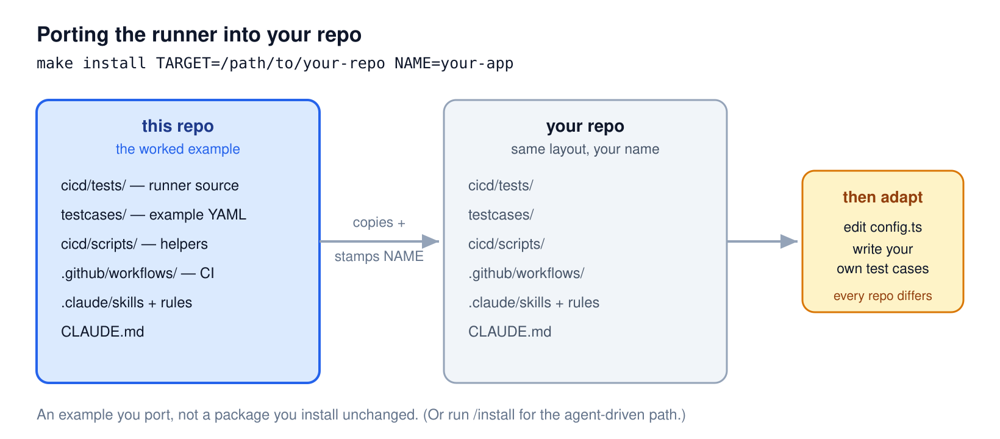
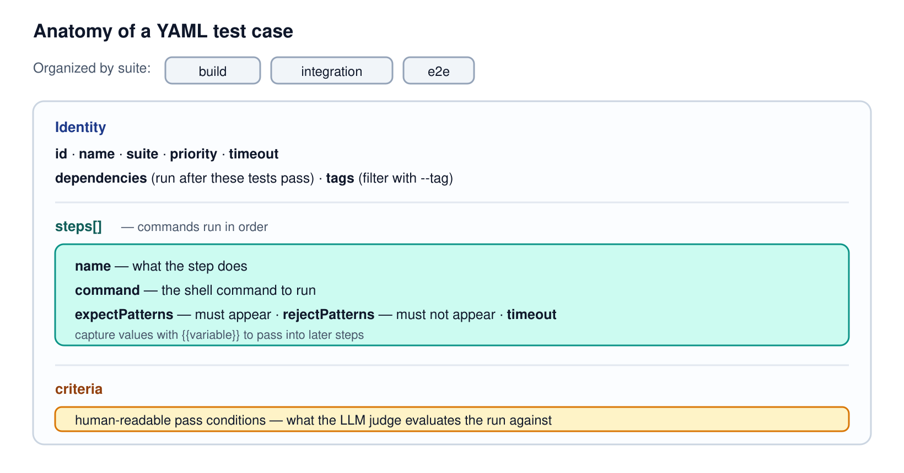
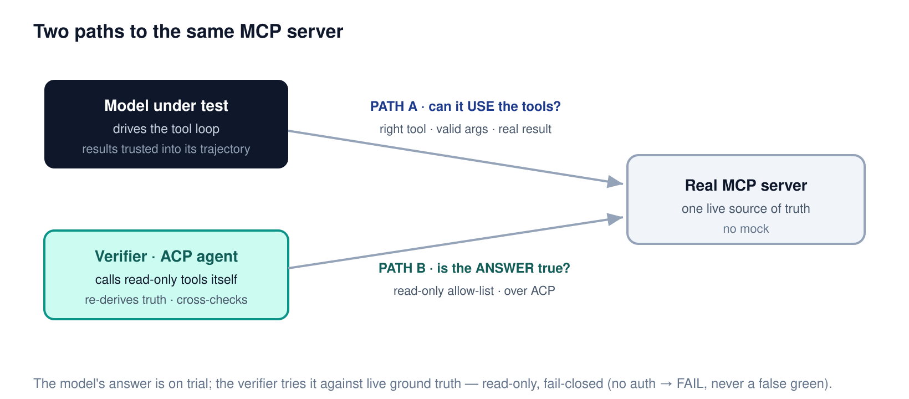

# agent-workflows-runner

**The QA half of the [`agent-workflows`](https://github.com/dogkeeper886/agent-workflows) family** — a YAML-driven, dual-judge test framework, plus the `qa-*` commands that author the tests it runs: **a worked example you port into your own repo**, not a package you install unchanged.

This repo owns the whole QA lifecycle — plan, author, bind, audit, run. `agent-workflows` keeps the **ship tail** (branch → PR → merge), the **report contract**, and the review skills; the `qa-*` commands cite two of its rules, so it is a prerequisite rather than an alternative. Neither is complete alone.

Testing here is fast and deterministic by default (the simple judge), with an opt-in agent judge as a second opinion — an Agent Client Protocol client that runs **keyless on a Claude Code subscription**, so no Console API key is needed and swapping the model or vendor is just configuration.



## Contents

- [Why this framework](#why-this-framework)
- [How the dual judge works](#how-the-dual-judge-works)
- [The ACP agent judge](#the-acp-agent-judge)
- [Quick start — port it in](#quick-start--port-it-in)
- [Configuration](#configuration)
- [Running tests](#running-tests)
- [Writing test cases](#writing-test-cases)
- [CI workflow patterns](#ci-workflow-patterns)
- [MCP testing](#mcp-testing)
- [MCP tool-call testing](#mcp-tool-call-testing)
- [Skills and commands](#skills-and-commands)
- [Directory structure](#directory-structure)
- [The agent family](#the-agent-family)
- [License](#license)

## Why this framework

Testing on exit codes alone misses the failures that matter: a process exits `0` but produces the wrong output. This runner pairs a fast deterministic judge with an opt-in semantic one, so a test passes only when the result is *actually* right.

Because the semantic judge brings a reasoning model to the verdict, the framework is more than a static-script checker for one product:

| Use case | What it covers | Status |
|----------|----------------|--------|
| **Static / deterministic testing** | exit codes, expected patterns, error detection — the simple judge | **shipping** |
| **AI-produced content testing & audit** | the agent judge grades generated output against human-readable criteria, not just pass/fail commands | **shipping** |
| **Agent-driven testing via MCP** | a model drives a real MCP server's tools, and the judge attaches the same server to verify the answer against live tool results | **shipping** |

> Agent-driven testing via MCP now ships as the `test-mcp` command (see [MCP tool-call testing](#mcp-tool-call-testing)): one path drives the model-under-test through the server's tools; the other lets the judge call the server's read-only tools itself to check the answer against live ground truth. This is distinct from `mcp-client.ts`, which calls a single tool from a test step (see [MCP testing](#mcp-testing)).

## How the dual judge works



The **simple judge** always runs — deterministic, model-free, milliseconds. The **agent judge** runs only when you opt in with `JUDGE_MODE=dual`, and then **both must pass**. An unreachable or unauthenticated agent degrades cleanly, falling back to the simple judge with a notice.

| Scenario | Exit code | Simple judge | Agent judge |
|----------|-----------|--------------|-----------|
| Command fails | 1 | catches | catches |
| "Error" in output | 0 | catches | catches |
| Wrong output format | 0 | misses | catches |
| Incomplete results | 0 | misses | catches |
| Semantic mismatch | 0 | misses | catches |

## The ACP agent judge

The [Agent Client Protocol](https://agentclientprotocol.com) (ACP) is an open, vendor-neutral standard — created by [Zed Industries](https://zed.dev) — for driving coding agents over a JSON-RPC stdio link. The agent judge is an ACP **client**: it spawns a configured agent as a child process, runs one prompt turn per test (`initialize → session/new → session/prompt`), and reads back a JSON verdict — `{ pass, reason, evidence }`. It only evaluates — it refuses every tool-permission request the agent makes.


Routing the verdict through ACP is what makes the headline claims true:

- **Keyless.** Authentication is the agent's job, not the judge's. The bundled Claude agent runs on your Claude Code subscription (`~/.claude` locally, `CLAUDE_CODE_OAUTH_TOKEN` in CI) — no Console API key.
- **Any ACP agent.** Because ACP is a standard, the judge isn't tied to one vendor. Agents already exist for Gemini CLI, Codex CLI, GitHub Copilot, Goose, [and many more](https://agentclientprotocol.com/get-started/agents). This framework ships only the bundled Claude agent — but `JUDGE_AGENT` points the judge at any other, so changing model or vendor is config, not code.
- **MCP-capable.** An ACP session can hand the agent a set of MCP servers. The plain agent judge opens its session with none and acts on no tools — it evaluates, it doesn't gather. Attaching a server turns that same capability into the **live verifier**: the judge calls the server's read-only tools itself and checks the answer against live ground truth (see [MCP tool-call testing](#mcp-tool-call-testing)).

If the agent can't be reached or isn't authenticated, the judge detects it up front and falls back to the simple judge with a notice.

## Quick start — port it in

This repo is a worked example. The `make install` target copies the runner — source, example test cases, scripts, CI workflows, and Claude tooling — into your repo and stamps in your project name. You then adapt it; every project's tests differ.



```bash
cd /path/to/agent-workflows-runner
make install TARGET=/path/to/your/project NAME=your-project

cd /path/to/your/project/cicd/tests
npm install
npm test                 # run all tests with the simple judge
```

Then edit `cicd/tests/src/config.ts` for your project (see [Configuration](#configuration)) and write your own cases (see [Writing test cases](#writing-test-cases)).

Other Makefile targets:

```bash
make help                              # show usage
make clean TARGET=/path/to/project     # remove the framework from a project
make diagrams                          # re-render docs/diagrams/*.svg → png/
make check-install                     # install into a temp dir and run it — proves the payload works
```

**Agent-driven alternative.** In your project, tell Claude Code `/install /path/to/agent-workflows-runner` (or "Install the test framework from …"). The agent detects your project type, asks a few configuration questions, and installs only what you need with values pre-filled.

## Configuration

Edit `cicd/tests/src/config.ts` in your project:

```typescript
export const SUITES: string[] = ['build', 'integration', 'e2e'];

export const CONFIG = {
  projectName: 'your-project',

  // Agent judge — opt-in second opinion (default verdict is the simple judge)
  judge: {
    mode: process.env.JUDGE_MODE || 'simple',   // 'simple' | 'dual'
    agent: process.env.JUDGE_AGENT || '',        // '' → bundled Claude ACP agent (keyless); set to another ACP agent's command to swap model/vendor
    timeout: 300000,
    // …plus stdout/stderr/log truncation limits — see config.ts
  },
};

// Project-specific error patterns
export const ERROR_PATTERNS: RegExp[] = [/\berror\b/i, /\bfailed\b/i];
```

For CI, configure the judge through the environment instead of editing source:

| Variable | Purpose | Default |
|----------|---------|---------|
| `JUDGE_MODE` | `simple` (deterministic only) or `dual` (opt in the agent judge) | `simple` |
| `JUDGE_AGENT` | command that launches the ACP agent the judge drives; unset uses the bundled Claude ACP agent, keyless on a Claude Code subscription. Set it to another ACP agent to swap model/vendor — config, not code | unset |
| `CLAUDE_CODE_OAUTH_TOKEN` | authenticates the bundled Claude agent on a GitHub-hosted CI runner; not needed on a self-hosted runner that's logged into Claude Code (`~/.claude`) | unset |

> **Keyless by design.** The agent judge authenticates through the agent — your Claude Code login — not a Console API key, and the model lives in the agent, so swapping it (`JUDGE_AGENT`) is config, not code.

## Running tests

```bash
cd your-project/cicd/tests

npm test                    # all tests (simple judge — fast, no model)
npm test -- --suite build   # one suite
npm test -- --id TC-001     # one test
npm test -- --tag auth      # tests tagged 'auth'
npm test -- --dry-run       # preview what would run
npm run list                # list available tests

# opt in the agent judge (env-configured, not a flag)
JUDGE_MODE=dual npm test                              # keyless via your Claude Code login (~/.claude)
JUDGE_AGENT="my-acp-agent" JUDGE_MODE=dual npm test   # drive a different ACP agent (model/vendor)
```

## Writing test cases

A test case is YAML — configuration, not code. Drop files into `cicd/tests/testcases/<suite>/`.



```yaml
id: TC-BUILD-001
name: Project Build
suite: build
priority: 1
timeout: 60000
dependencies: []
tags: [build, compile]

steps:
  - name: Install dependencies
    command: npm install
    timeout: 60000

  - name: Run build
    command: npm run build
    expectPatterns:
      - "Successfully compiled"
    rejectPatterns:
      - "error"

criteria: |
  Verify the project builds without errors.
```

`expectPatterns` must appear in the step output; `rejectPatterns` must not; `criteria` is the human-readable pass condition the agent judge evaluates the run against.

### Tags

Tags drive per-feature filtering and CI splitting (`--tag`, `tag:` in workflows):

```yaml
tags: [auth, api]          # feature tags
tags: [build, compile]     # suite-aligned tags
tags: [smoke]              # category tags
```

### Variable capture

A step can capture a value from JSON output and pass it to a later step via `{{variable}}`. Variables resolve from captured output first, then fall back to `process.env` — a CI-friendly pattern.

```yaml
steps:
  - name: Create resource
    command: curl -s -X POST http://localhost:3000/api/resources -d '{"name":"test"}'
    expectPatterns: ["id"]
    capture:
      resourceId: "id"

  - name: Verify resource exists
    command: curl -s http://localhost:3000/api/resources/{{resourceId}}
    expectPatterns: ["test"]
```

Capture paths support dot-notation and array-find syntax:

| Path | Resolves to |
|------|-------------|
| `id` | `response.id` |
| `data.name` | `response.data.name` |
| `items[0].id` | first element's `id` |
| `data[name=foo].id` | first element in `data` where `name === "foo"` |
| `$[type=user].email` | root-array find where `type === "user"` |

MCP tool responses (double-encoded JSON in `content[0].text`) are unwrapped automatically before capture.

## CI workflow patterns

The framework ships composable GitHub Actions. The recommended pattern: each feature gets a thin workflow that delegates to the reusable `test-run.yml`.

```
.github/workflows/
├── build.yml                # standalone build step
├── test-run.yml             # reusable test runner (supports --tag and --suite)
├── test-feature-example.yml # example per-feature workflow (~25 lines)
└── ci.yml                   # full pipeline: build → tests in parallel
```

```yaml
# .github/workflows/test-auth.yml
name: "Test: Auth"
on:
  workflow_dispatch:
    inputs:
      judge_mode: { type: choice, options: ["simple", "dual"] }
  workflow_call:
    inputs:
      judge_mode: { type: string }
jobs:
  test:
    uses: ./.github/workflows/test-run.yml
    with:
      tag: auth
      judge_mode: ${{ inputs.judge_mode }}
```

**To add a feature test:** tag your cases (`tags: [my-feature]`), copy `test-feature-example.yml` to `test-my-feature.yml`, change the `tag`, and add it as a job in `ci.yml`. Configure the judge through repository Variables (`JUDGE_MODE`, and `JUDGE_AGENT` to swap agents); on a GitHub-hosted runner, add the `CLAUDE_CODE_OAUTH_TOKEN` secret so the agent authenticates keyless — a self-hosted runner logged into Claude Code needs no secret.

## MCP testing

The framework tests MCP across **three surfaces**, smallest to strongest:

| Surface | What it tests | How |
|---------|---------------|-----|
| **Single tool call** — `mcp-client.ts` | your server returns the right data | a test step calls one tool, you assert on the result |
| **Model drives the tools** — `test-mcp` | the model picks the right tool, valid args, real result, a real answer | the model runs the server's tool loop end-to-end |
| **Live verifier** — `test-mcp --verify-live` | the answer is *true* against live data | the judge calls the server's read-only tools itself and cross-checks |

The single-tool surface is below; the model-driven and verifier surfaces are in [MCP tool-call testing](#mcp-tool-call-testing).

For MCP server projects, `mcp-client.ts` spawns your server and calls a tool, so you can assert on the result in a test step:

```bash
export MCP_SERVER_COMMAND="node dist/mcpServer.js"
npx tsx cicd/tests/src/mcp-client.ts get_venues '{}'
```

```yaml
steps:
  - name: Query venues
    command: npx tsx cicd/tests/src/mcp-client.ts get_venues '{}'
    expectPatterns: ["totalCount"]
    rejectPatterns: ["isError"]
```

`@modelcontextprotocol/sdk` ships with the runner — no separate install.

## MCP tool-call testing

The `test-mcp` command answers two questions a static check can't: **can the model use the tools**, and **is its answer true**. Both run against your *real* MCP server — no mock.



```bash
cd cicd/tests

# 1. Can the model drive the tools? (structural: right tool, valid args, real result, an answer)
npm run test:mcp -- llama3.1 --prompt "List the projects."

# 2. + semantic check of the answer over the captured trajectory (keyless agent judge)
npm run test:mcp -- llama3.1 --prompt "List the projects." --judge

# 3. + verify against LIVE truth: the judge calls the server's read-only tools itself
npm run test:mcp -- llama3.1 --prompt "List the projects." \
  --verify-live --verify-allow list_projects
```

Point it at your server and model runtime in `.env` (copy `.env.example`): `MCP_COMMAND` / `MCP_ARGS` / `MCP_ENV` (credential **names**, never values), and `MCP_BACKEND` / `OLLAMA_HOST` for the model. It prints a per-model markdown summary and writes a JSON report with `-o`.

**The live verifier** is the headline. `--verify-live` attaches your server to an isolated, keyless ACP agent and lets it call **only** the tools you allow-list (read-only by intent — enforced by a permission gate *and* the agent SDK's deny-list). It fetches the ground truth itself, grades the answer against it, and a deterministic cross-check overrides any answer that claims data the tools don't return. If the verifier can't authenticate, it **fails closed** — a clear FAIL, never a false green.

Drive it in CI with `.github/workflows/test-mcp.yml` (`mode: simple | judge | verify-live`); the verifier needs `CLAUDE_CODE_OAUTH_TOKEN` and a reachable server + model host.

## Skills and commands

The tooling splits three ways — a **plugin you install**, skills **copied into your project** by `/install`, and the **maintainer tooling** this repo is built with.

### The QA lifecycle plugin — `qa-*`

The commands that turn a spec into trustworthy tests ship as a Claude Code plugin, from this repo's own marketplace. Installing beats copying: a plugin update moves every project at once, where a copied `.claude/` directory leaves each repo on its own fork.

```bash
# Prerequisite 1: agent-workflows, whose agent-report and profile-doctrine rules
# the qa-* commands cite. Claude Code can't express a dependency between plugins.
/plugin marketplace add dogkeeper886/agent-workflows
/plugin install agent-workflows@agent-workflows

/plugin marketplace add dogkeeper886/agent-workflows-runner
/plugin install agent-workflows-runner@agent-workflows-runner

# Prerequisite 2: the framework itself, in your project — qa-bind and qa-review-bind
# shell out to its scripts (make install, above). Then adopt the plugin into the repo:
/setup-agent-runner
```

| Producer → review | What the pair covers |
|-------------------|----------------------|
| `/qa-plan` → `/qa-review-plan` | what to test — scenarios persisted as a `[#<spec>] Test Plan` issue |
| `/qa-cases` → `/qa-review-cases` | the test docs in `docs/tests/` (the [format contract](docs/tests/README.md)) |
| `/qa-bind` → `/qa-review-bind` | each case bound to the YAML that runs it — the audit is the gate, exiting non-zero for CI |

No producer ships without its review. Project-specific values — paths, labels, id schemes — resolve from your `.claude/rules/project-profile.md`, never from the commands.

The plugin also carries **`connected-flow`**, the design rules a bound executable must follow: one connected end-to-end flow, no hardcoded instance IDs, stable-named fixtures created idempotently and torn down at the end. `qa-bind` and `qa-review-bind` load it, because the binding audit is structural — it counts steps, and none of those violations changes a step count. `/setup-agent-runner` writes your project's instantiation of the rules into the profile, checks both prerequisites, and finds forked copies of the units an earlier install left behind.

### Shipped into your project by `/install`

AI-assisted test authoring:

| Skill | Purpose |
|-------|---------|
| `/install` | install the framework into a project (the entry point; ships the three below) |
| `/ci-testcase` | generate YAML test cases from requirements |
| `/ci-run` | execute tests with guided output |
| `/add-tool` | add new MCP tools following standard patterns |

**Maintainer tooling** — the workflow this repo is built with (see `CLAUDE.md` §5–6). Most of it is installed, not carried here:

| Artifact | Role | Comes from |
|----------|------|------------|
| `dw-*` and `doc-*` commands | story → plan → tasks → implement → PR → merge, and codebase → README | the `agent-workflows` plugin |
| `dw-test-design` | writes the tests after implement, native to whatever framework the project already uses | this repo — `.claude/commands/` |
| `reviewing-phrasing` / `reviewing-typography` | human-read doc review — the words / the look | the `agent-workflows` plugin |
| `reviewing-artifacts` | agent-read artifact review (commands, skills, docs) | the `agent-workflows` plugin |
| `review-docs-privacy` | security + documentation-quality review | this repo — `.claude/skills/` |

The `reviewing-*` skills still have older copies under this repo's `.claude/skills/` that shadow the plugin's; removing them is pending.

## Directory structure

What `make install` lays down in your project:

```
your-project/
├── CLAUDE.md                    # AI agent guidance
├── .claude/
│   ├── skills/                  # /ci-testcase, /ci-run, /add-tool
│   └── rules/                   # YAML schema + CI workflow patterns
├── cicd/
│   ├── tests/
│   │   ├── src/
│   │   │   ├── config.ts        # ← configure here
│   │   │   ├── cli.ts  loader.ts  executor.ts  types.ts
│   │   │   ├── mcp-client.ts    # single-tool MCP client
│   │   │   ├── mcp/             # test-mcp: chat-backend seam, host loop, backends/
│   │   │   ├── log-collector.ts
│   │   │   ├── judge/           # simple + agent + verifier (live MCP) judges
│   │   │   └── reporter/        # console + JSON
│   │   ├── testcases/
│   │   │   ├── build/           # ← your tests
│   │   │   ├── integration/
│   │   │   └── e2e/
│   │   ├── scripts/             # mock MCP server + the check:* guards
│   │   ├── package.json
│   │   └── tsconfig.json
│   ├── scripts/
│   │   └── format-results.sh
│   └── results/
└── .github/workflows/           # build.yml, test-run.yml, ci.yml, …
```

## The agent family

This runner is one of three repos (see the diagram up top):

| Repo | Role | Status |
|------|------|--------|
| [**agent-workflows**](https://github.com/dogkeeper886/agent-workflows) | the ship tail (branch → PR → merge), the report contract, and the review skills — a prerequisite of this repo's plugin | shipped |
| **agent-workflows-runner** (this repo) | the whole QA lifecycle: the `qa-*` commands that plan, author and bind test docs, and the dual-judge framework that runs them | shipped |
| **agent-studio** | local-first web GUI over the workflows + runner; closes the Dev → QA → PM loop | working name (currently `ai-qa-studio`), planning |

## License

MIT
