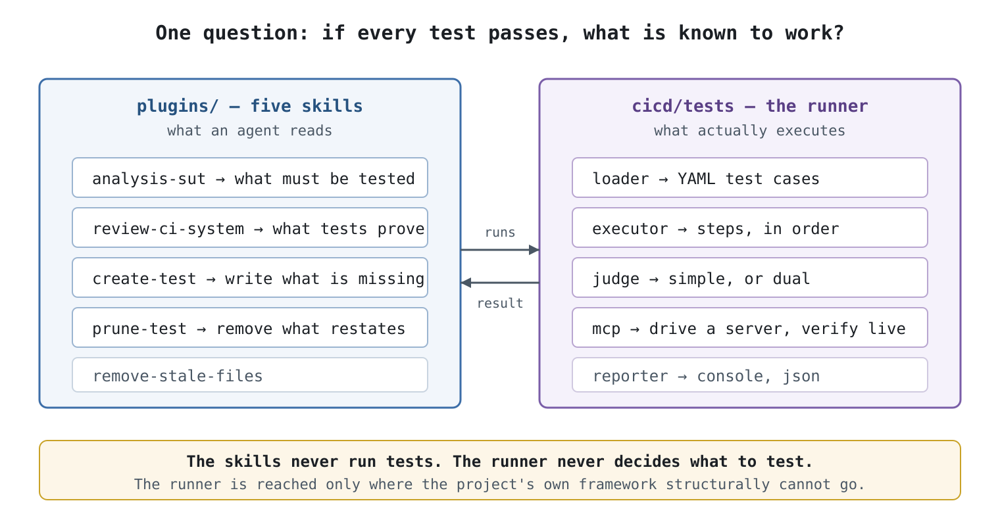
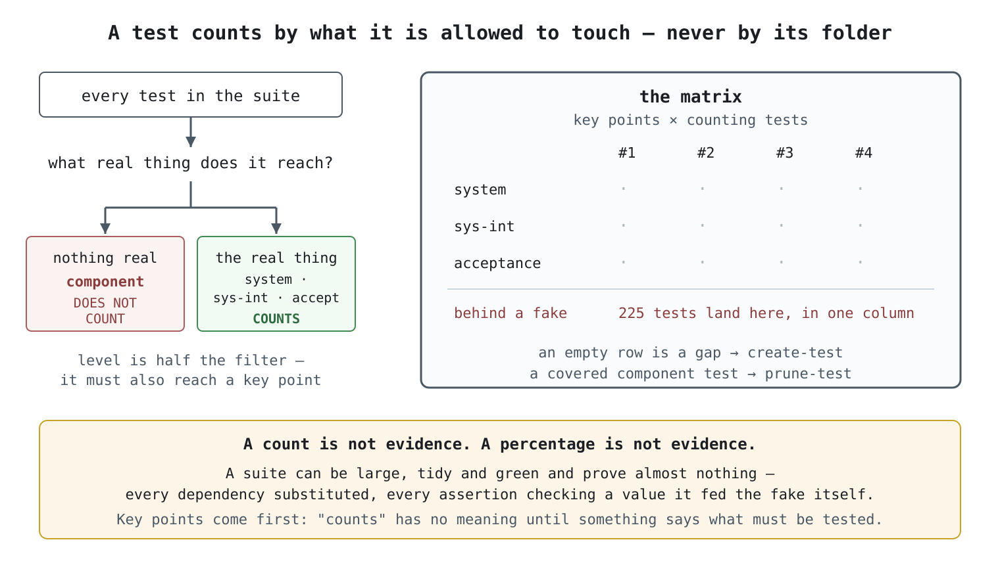
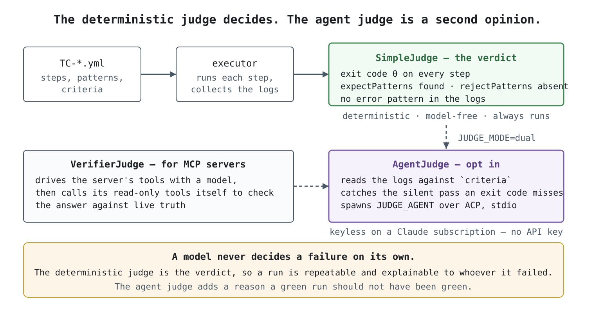

# agent-workflows-runner

Five Claude Code skills that decide what a project must test and judge what its tests
actually prove, plus a YAML test runner for the checks a unit suite structurally cannot make.

## Install the skills

```
/plugin marketplace add dogkeeper886/agent-workflows-runner
/plugin install agent-workflows-runner@agent-workflows-runner
```

Then ask in your own words, or invoke one by name:

```
/agent-workflows-runner:review-ci-system
/agent-workflows-runner:create-test the write path
```

## Run the test runner

Requires Node 18 or newer.

```bash
cd cicd/tests
npm install
npm test                    # the whole suite
npm test -- --suite build   # one suite
npm run list                # what would run
```

## The problem

A suite of a few hundred passing tests reads as protection. Then something ships broken,
and the tests were never going to catch it: every dependency was substituted, and every
assertion checked a value the test had fed the substitute itself.

Size does not detect that. Neither does a coverage percentage, or a directory named
`integration/`. One question does: **if every test passes, what is now known to work?**
Answering it is what this repo is for.

## How it works



Two halves that never do each other's job. The skills read the code, judge the suite and
write tests in whatever framework the project already uses. The runner executes YAML test
cases against real processes, reached only where the project's own framework structurally
cannot go. A second runner earns its place only there, because one placed beside a working
suite leaves two answers to *did it pass*.

### What counts as coverage



Every test is classified by **what it is allowed to touch**, never by its folder or its name.
Component and component-integration tests may exist, but they assert today's internal
structure. They answer *did I break this refactor* rather than *does this work*, so they do
not count toward coverage, and `prune-test` proposes removing them once the level above covers
the same ground.

Level is only half the filter. A test also counts only where it reaches a **key point**,
one of the few things the system must do, derived from the code by `analysis-sut`. That
dependency forces the order: a suite cannot be judged from the tests alone.

### The dual judge



The runner's verdict is deterministic: exit codes, `expectPatterns` found, `rejectPatterns`
absent. A model never decides a failure on its own, so a run is repeatable and explainable to
whoever it failed.

Set `JUDGE_MODE=dual` and an agent judge reads the same logs against the test's `criteria`
and gives a second opinion. The case it catches is the silent pass, where every command
exits 0 and the thing still did not work. It runs over the Agent Client Protocol against
`JUDGE_AGENT`, keyless on a Claude subscription locally, `CLAUDE_CODE_OAUTH_TOKEN` in CI.

## The skills

| Skill | What it does |
|---|---|
| [analysis-sut](plugins/agent-workflows-runner/skills/analysis-sut/SKILL.md) | Derives what the system must do, from the code rather than the docs |
| [review-ci-system](plugins/agent-workflows-runner/skills/review-ci-system/SKILL.md) | Says what passing proves, and what it does not |
| [create-test](plugins/agent-workflows-runner/skills/create-test/SKILL.md) | Writes a test that reaches something real, and runs it until it earns its place |
| [prune-test](plugins/agent-workflows-runner/skills/prune-test/SKILL.md) | Removes tests now covered above them, and refuses where they are not |
| [remove-stale-files](plugins/agent-workflows-runner/skills/remove-stale-files/SKILL.md) | Deletes what this plugin's earlier versions left behind |

## Writing a test case

A test case is YAML: steps that run commands, patterns that must appear or must not, and
`criteria` in prose for the agent judge. `cicd/tests/testcases/integration/TC-INT-MCP-001.yml`
is a working one.

```yaml
id: TC-INT-MCP-001
name: MCP tool call returns the server's data
suite: integration
priority: 5
timeout: 60000
dependencies: []
tags: [mcp]

steps:
  - name: Call get_fact on the bundled mock MCP server
    command: cd cicd/tests && npx tsx src/mcp-client.ts get_fact '{}'
    expectPatterns: ["5500", "sky is blue"]
    rejectPatterns: ["isError"]

criteria: |
  The client connects, calls get_fact, and returns the server's payload.
```

`dependencies` orders the run and threads fixtures between stages; `capture` lifts a value
out of one step's output for a later one.

## Testing an MCP server

`npm run test:mcp` drives a real stdio MCP server with a model and checks what came back, at
three depths: structurally (the right tool, valid arguments, a real result), semantically
(the agent judge over the captured trajectory), and against live truth, where the verifier
calls the server's own read-only tools to check the answer rather than trusting it.

Configure the server in `cicd/tests/.env`; `cicd/tests/.env.example` documents every variable
and ships no credentials.

## CI

Seven workflows in `.github/workflows/`, all triggered by hand or called by another workflow.
Nothing runs on push. `test-run.yml` is the reusable one; the rest wrap it for a suite, a
feature, or an MCP server.

## Contributing

This repo is its own marketplace: the plugin is developed in the same tree that serves it, so
the skills are used the way they ship. Add this directory as a marketplace source and restart
the session to load an edit, including one not yet committed.

Diagrams are SVG sources committed alongside PNGs rendered by an explicit command:

```bash
docs/diagrams/render.sh
```

`.sessions/` holds raw agent transcripts, copied byte for byte out of `~/.claude/projects/`
and unfiltered. A log informs; it never binds. The code binds on what is true now.

## License

MIT, as declared in
[plugin.json](plugins/agent-workflows-runner/.claude-plugin/plugin.json).
